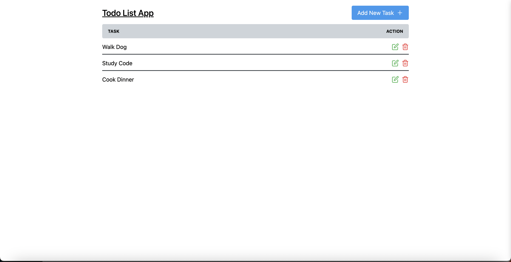

# Todo App

This project is a Todo application built with Next.js, TypeScript, and Tailwind CSS. It is a personal project aimed at mastering Next.js and TypeScript through practical implementation.

## Table of Contents

- [Todo App](#todo-app)
  - [Table of Contents](#table-of-contents)
  - [About The Project](#about-the-project)
  - [Technical Objectives](#technical-objectives)
  - [Contact](#contact)

## About The Project

The Todo-App Project is a dive into the capabilities of Next.js, and TypeScript. The project presents opportunities to demonstrate and experiment with the various features and utilities that Next.js and TypeScript together.

## Technical Objectives

While developing this project, my key objectives included:

1. Expanding my understanding and proficiency in Next.js.
2. Exploring and implementing best practices for building applications with Next.js.
3. Expanding my understanding and proficiency in TypeScript.
4. Understanding Next.js 13 App Folder Structure.
5. Understanding Next.js 13 Client Components vs Server Components.
6. Understanding Next.js 13 File-based Routing.
7. Understanding Next.js 13 page, layout.
8. Understanding Next.js 13 with json-server data.

## Contact

- [LinkedIn](https://www.linkedin.com/in/jerome-haynes/)
- [Dev-Rome](https://github.com/dev-rome)
- [Website](https://jeromehaynes.com/)
